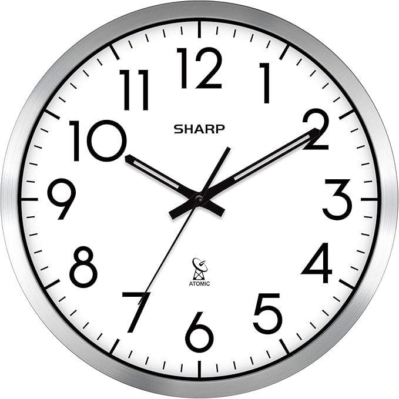

# WatchTower WWVB Transmitter — Sydney Build



A self-contained, set-and-forget box that permanently broadcasts a 60 kHz WWVB time signal,
keeping a Sharp atomic wall clock showing correct Sydney time (AEST/AEDT) automatically,
year-round — no phone required, no manual adjustment.

This is a fork of [emmby/WatchTower](https://github.com/emmby/WatchTower), adapted for
**Sydney, Australia** using off-the-shelf parts from **Jaycar Electronics**. The upstream
project targets US hobbyists with Adafruit components; this build substitutes locally
available equivalents and adds the timezone offset logic needed to drive a US-only clock
from Australia.

---

## How it works

WatchTower runs on an ESP32 development board. It connects to your Wi-Fi network, syncs the
current time via NTP, and then continuously transmits a 60 kHz PWM signal that mimics the
WWVB time signal broadcast from Fort Collins, Colorado. A Sharp atomic wall clock sitting
within range of the ferrite antenna picks up the signal and sets itself automatically.

### About WWVB

WWVB transmits one bit per second at 60 kHz, encoding a full 60-bit time-and-date frame
every minute using Pulse Width Modulation. Each bit is actually a "trit" — a zero, one, or
mark — encoded by the width of the low pulse:

| Low pulse width | Trit value |
|----------------|-----------|
| 0.2 s | 0 |
| 0.5 s | 1 |
| 0.8 s | mark |

The mark trits provide framing: two consecutive marks tell the receiver it's at the start of
a new minute. The 60-bit frame encodes minutes, hours, day-of-year, year, leap year, DST
state, and UTI correction. The signal is modulated onto a 60 kHz carrier wave using a 50%
duty cycle for high and 0% duty cycle for low. The H-bridge chip amplifies the ESP32's 3.3 V
output to 5 V to drive the ferrite antenna coil.

### The Sydney time offset

The Sharp clock is a US model. It only supports US time zones and is set to **Central Time
(UTC−6), DST off** — meaning it subtracts exactly 6 hours from whatever it receives in the
WWVB signal. To make it display correct Sydney time, WatchTower transmits Sydney local time
plus 6 hours:

| Season | Sydney offset | Transmitted offset | Clock displays |
|--------|:------------:|:-----------------:|:--------------:|
| AEST (winter) | UTC+10 | UTC+16 | UTC+16 − 6 = UTC+10 ✓ |
| AEDT (summer) | UTC+11 | UTC+17 | UTC+17 − 6 = UTC+11 ✓ |

This is achieved via a POSIX timezone string in the code (negative offset = ahead of UTC):

```cpp
const char* TZ_INFO = "AEST-16AEDT-17,M10.1.0,M4.1.0/3";
```

Australian DST transitions are encoded in the string and handled automatically:
- DST starts: first Sunday of October
- DST ends: first Sunday of April at 03:00

---

## Parts list — Jaycar Electronics

| # | Item | Cat. No. | Qty | Price (ea.) | Notes |
|---|------|----------|:---:|:-----------:|-------|
| 1 | Keyestudio ESP32 Core Board (KS0413) | **XC3800** | 1 | $49.95 | The brain — Wi-Fi, NTP, signal generation |
| 2 | L9110H Bridge Motor Driver IC (DIP-8) | **ZK8882** | 1 | ~$3.50 | H-bridge that drives the coil |
| 3 | Arduino Compatible Breadboard 400 Tie Points | **PB8820** | 1 | $9.95 | 83 mm × 55 mm — fits the HB6011 box |
| 4 | Breadboard Jumper Wire Kit | **PB8850** | 1 | $12.50 | Assorted lengths and colours |
| 5 | 1/2W Metal Film Resistor Pack (300 pcs) | **RR0680** | 1 | $12.95 | You need one 1 kΩ |
| 6 | 9 mm × 100 mm Ferrite Rod (bare) | **LF1010** | 1 | $2.95 | Core of the transmit antenna |
| 7 | Enamelled Copper Winding Wire (0.25 mm) | **WW4516** | 1 | ~$7.95 | For winding the 60 kHz coil |
| 8 | Jiffy Box — Black — 158 × 95 × 53 mm | **HB6011** | 1 | $5.25 | Fits breadboard + ESP32 comfortably |
| 9 | USB A to Micro B Cable 1.8 m | **WC7724** | 1 | $16.95 | Powers the ESP32 |
| 10 | USB 5V/1A Wall Charger | any phone charger | 1 | ~$10–15 | Standard phone charger works fine |

> **Check stock before you go.** Call ahead or check jaycar.com.au for LF1010 and WW4516 —
> smaller stores don't always carry the full ferrite and wire range. Everything else is
> stocked at virtually every branch.

**Estimated total: ~$125–140**

### What you'll also need at home

- Mac, Windows, or Linux computer with a free USB port
- Small flat-head screwdriver
- Scissors or hobby knife
- Sticky tape or small cable tie
- Fine sandpaper or a lighter (to strip enamel from wire ends)
- Small drill or sharp nail (to make the USB cable hole in the box)

---

## Software setup

Do this before touching any hardware.

### Step 1 — Install the CP2102 driver (Mac)

The KS0413 uses a CP2102-GMR USB-to-serial chip. macOS does not include this driver.

1. Go to https://www.silabs.com/developers/usb-to-uart-bridge-vcp-drivers
2. Download the **CP210x VCP Mac OSX Driver**
3. Open the `.dmg`, run the installer, restart your Mac
4. After restarting open **System Settings → Privacy & Security**, scroll to the bottom, and
   click **Allow** next to the Silicon Laboratories message
5. Restart again if prompted

When the ESP32 is plugged in it will appear as `/dev/cu.usbserial-0001` in Arduino IDE.

### Step 2 — Install Arduino IDE

Download and install from https://www.arduino.cc/en/software

### Step 3 — Add ESP32 board support

1. Open Arduino IDE → **File → Preferences**
2. In *Additional boards manager URLs*, paste:
   ```
   https://raw.githubusercontent.com/espressif/arduino-esp32/gh-pages/package_esp32_index.json
   ```
3. Click OK, then go to **Tools → Board → Boards Manager**
4. Search `esp32`, find **Espressif Systems**, click **Install** (~2–3 minutes)

### Step 4 — Download this repository

```
https://github.com/vmlrodrigues/WatchTower
```

Click **Code → Download ZIP** and extract to a convenient folder. Open `WatchTower.ino` in
Arduino IDE.

### Step 5 — Install required libraries

**Via Library Manager (Tools → Manage Libraries):**

| Library | Search term | Author |
|---------|------------|--------|
| WiFiManager | `WiFiManager` | tzapu |
| Adafruit NeoPixel | `Adafruit NeoPixel` | Adafruit |
| ArduinoJson | `ArduinoJson` | Benoit Blanchon |
| ESPUI | `ESPUI` | Lukas Bachschwell |

> The NeoPixel library is required for compilation even though the KS0413 has no built-in
> NeoPixel. It compiles in and does nothing visible.

**Via manual ZIP install:**

Download, unzip directly into your Arduino libraries folder, and rename to remove any
`-master` suffix. **Do not** use Sketch → Include Library → Add .ZIP Library — it silently
fails on some macOS setups.

Your Arduino libraries folder:
```
/Users/[your username]/Documents/Arduino/libraries/
```

| Library | Source |
|---------|--------|
| ESPAsyncWebServer | https://github.com/ESP32Async/ESPAsyncWebServer |
| AsyncTCP | https://github.com/ESP32Async/AsyncTCP |

> **Note:** The original `me-no-dev` repositories for these two libraries were archived in
> January 2025. Use the **ESP32Async** organisation links above — they are the
> community-maintained successors and are actively developed.

> **ESPmDNS** (used for `watchtower.local`) is built into the ESP32 Arduino core. No
> separate install is needed.

After installing all libraries, **restart Arduino IDE completely** before proceeding.

### Step 6 — Verify the code compiles

1. **Tools → Board → ESP32 Dev Module**
2. Click the **Verify** button (tick/checkmark icon)
3. Wait 30–60 seconds for compilation
4. Confirm the output bar shows **"Done compiling"** with no errors

---

## Pin reference

### KS0413 Keyestudio ESP32 — 38-pin board

The USB connector is at the top. Pins are labelled in yellow text on the black PCB.

**Left side — top to bottom:**

| Row | Label | WatchTower |
|:---:|-------|-----------|
| 1 | **5V** | → L9110H VCC (pin 2) ★ |
| 6 | **GND** | → L9110H GND (pins 5 & 8) ★ |
| 2–5, 7–19 | various | not used |

**Right side — top to bottom:**

| Row | Label | WatchTower |
|:---:|-------|-----------|
| 7 | **IO4** | → L9110H IA (pin 6) ★ |
| all others | various | not used |

> **The two buttons on the board:**
> - **EN** — resets the ESP32. Press after uploading code.
> - **BOOT** — forces firmware download mode. If Arduino IDE gets stuck on
>   *"Connecting........"* during upload, hold BOOT, click Upload in the IDE, then release
>   BOOT when *"Connecting..."* appears. The KS0413 often requires this.

### L9110H DIP-8 — pin reference

> **Important:** This chip's pinout differs from other L9110 variants. Do not use pinouts
> from generic L9110 or L9110S guides — they will be wrong for the H variant.

The chip has a semicircular notch at one end. **Pin 1 is top-left when the notch faces up.**
Place the chip straddling the breadboard centre gap with the notch pointing toward the USB
end of the ESP32.

```
      NOTCH
    ┌───┴───┐
1   │  OA   │  8 — GND
2   │  VCC  │  7 — IB   (unused)
3   │  VCC  │  6 — IA
4   │  OB   │  5 — GND
    └───────┘
```

| Pin | Name | WatchTower connection |
|:---:|------|-----------------------|
| 1 | OA | → 1 kΩ resistor → Coil Lead A |
| 2 | VCC | → ESP32 **5V** (left side, row 1) |
| 3 | VCC | join to pin 2, or leave floating |
| 4 | OB | leave unconnected |
| 5 | GND | → GND rail — **also connect Coil Lead B here** |
| 6 | IA | → ESP32 **IO4** (right side, row 7) |
| 7 | IB | leave unconnected |
| 8 | GND | → GND rail (bridge to pin 5 with a short jumper) |

---

## Building the ferrite antenna

Takes about 15–20 minutes.

**You need:** LF1010 ferrite rod · WW4516 wire · scissors · sticky tape · sandpaper or lighter

1. **Secure the start.** Fix one end of the wire to one end of the rod with sticky tape,
   leaving 8–10 cm free as a lead. This is **Lead A**.

2. **Wind 70 turns.** Wind tightly in one direction, keeping each turn directly against the
   previous one. Count carefully — all 70 turns will occupy roughly 20–25 mm of the rod.

3. **Secure the end.** Hold the coil in place with sticky tape or a cable tie. Cut the wire
   leaving 8–10 cm free. This is **Lead B**.

4. **Strip the enamel.** Remove the enamel coating from the last 15–20 mm of both leads
   using sandpaper, a hobby knife, or a brief pass through a lighter flame. Both ends should
   be bright copper.

---

## Circuit assembly

**Seating the components**

Place the ESP32 at one end of the breadboard straddling the centre gap. Place the L9110H
about 8–10 holes away with the notch pointing toward the ESP32's USB end.

**Wiring**

```
ESP32 left  side row 1  (5V)   ────  L9110H pin 2  (VCC)
ESP32 left  side row 6  (GND)  ────  L9110H pin 5  (GND)
                                      L9110H pin 8  (GND) — bridge to pin 5 with a jumper
ESP32 right side row 7  (IO4)  ────  L9110H pin 6  (IA)

L9110H pin 1 (OA)  ── 1 kΩ resistor ──  Coil Lead A
GND rail           ─────────────────────  Coil Lead B  (no resistor)
```

The 1 kΩ resistor limits current through the coil — do not omit it. Coil Lead B connects
directly to the GND rail with no resistor. The ferrite rod can rest alongside the breadboard;
it does not need to be mounted to it.

---

## Uploading the code

1. Connect the ESP32 to your Mac with the Micro USB cable
2. **Tools → Board → ESP32 Dev Module**
3. **Tools → Port → /dev/cu.usbserial-0001**
4. Click **Upload** (right-arrow icon)
5. If it gets stuck on *"Connecting........"*: hold **BOOT**, click Upload again, release
   **BOOT** when *"Connecting..."* appears
6. Wait for *"Done uploading"* (~30–60 seconds)
7. Open **Tools → Serial Monitor** at baud rate **115200**
8. Press **EN** on the ESP32 to restart it

---

## First-time Wi-Fi setup

1. On your phone or computer, connect to the Wi-Fi network **WatchTower**
2. A captive portal page opens — tap **Configure WiFi**
3. Select your home network, enter your password, tap **Save**
4. The ESP32 connects, syncs the time via NTP, and the WatchTower hotspot disappears
5. Serial Monitor will show the current Sydney time

Wi-Fi credentials are stored in flash memory — the board reconnects automatically on every
subsequent power-up.

---

## Testing

### Test 1 — Confirm signal is transmitting

Open Serial Monitor (baud rate 115200). You should see output similar to:

```
Got the time from NTP
Connect to http://watchtower.local for the console
Sunday, June 07 2026 14:32:05.123+1600 AEST [last sync Jun 07 14:32]: 1
Sunday, June 07 2026 14:32:05.456+1600 AEST [last sync Jun 07 14:32]: 0
```

Alternating 1 and 0 confirms the transmitter is running. The `[last sync]` timestamp
confirms NTP is working. You can also open `http://watchtower.local` in a browser to see
the live web dashboard with current time, date, uptime, and the WWVB broadcast waveform.

### Test 2 — Sync the clock

1. Hold the ferrite rod flat against the **back of the Sharp clock near the top edge** —
   this is where the clock's internal receiver coil sits
2. Align the rods in parallel (both horizontal, both pointing the same direction)
3. Press the clock's manual sync button, or wait 1–3 minutes
4. Confirm the displayed time matches current Sydney local time

### Test 3 — Find maximum reliable range

Move the ferrite rod away from the clock in 5 cm increments. With a 70-turn coil and the
L9110H driver, expect 15–30 cm of reliable range. A 5V/2A supply (instead of a standard
phone charger) can extend range.

---

## Final assembly in the Jiffy box

1. Drill or melt a small hole in one short end of the HB6011 box for the Micro USB cable
2. Cut a slot in the lid for the ferrite rod, or run the coil leads through the lid and
   rest the rod on top of the closed box
3. Place the breadboard assembly inside — the adhesive backing holds it in place
4. Route the USB cable out through the hole, close and screw down the lid
5. Plug into a USB charger and position near the clock

**Placement:** the ferrite rod should point horizontally, parallel to the clock face,
with its long axis aligned with the clock's internal receiver coil (usually running
left-to-right across the top rear of the clock). Start with the box touching the clock,
confirm sync, then move it back until you find the maximum working distance.

---

## Ongoing operation

| Function | Detail |
|----------|--------|
| NTP time sync | Automatic, every few hours |
| AEST → AEDT | Automatic — first Sunday in October |
| AEDT → AEST | Automatic — first Sunday in April |
| Power draw | ~200–300 mA at 5V |
| Clock auto-sync | Sharp clocks sync nightly at 2 am and 3 am |
| Maintenance | None required |

---

## Changes from upstream

This fork differs from [emmby/WatchTower](https://github.com/emmby/WatchTower) in the
following ways:

| Change | Detail |
|--------|--------|
| `PIN_ANTENNA` | Changed from 13 to **4** (IO4 on KS0413) |
| `TZ_INFO` | Set to `AEST-16AEDT-17,M10.1.0,M4.1.0/3` for Sydney offset trick |
| WWVB signal source | Changed from `buf_now_utc` to `buf_now_local` so the timezone offset is actually applied to the transmitted signal |
| mDNS library | Replaced `ArduinoMDNS` (unmaintained) with `ESPmDNS` from the ESP32 core |

---

## Quick reference

```
Mac serial port:    /dev/cu.usbserial-0001
Arduino board:      ESP32 Dev Module
Wi-Fi hotspot:      WatchTower  (first boot only)
Web dashboard:      http://watchtower.local
Timezone string:    AEST-16AEDT-17,M10.1.0,M4.1.0/3
Clock setting:      Central Time, DST off
Upstream repo:      https://github.com/emmby/WatchTower
```

---

*Based on the WatchTower project by Mike Burton — github.com/emmby/WatchTower*  
*Adapted for Sydney, Australia using Jaycar Electronics components.*
